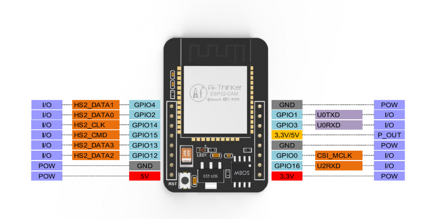
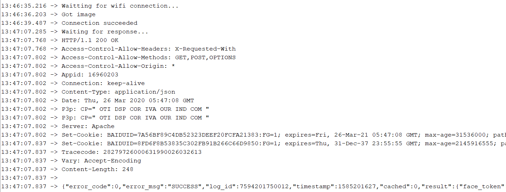

## 在ESP32-CAM(Arduino Core)上使用[Baidu AI](https://ai.baidu.com/)的人脸识别API
---

### 如何使用
---
- 修改ACCESS_TOKEN，如何获取请访问[百度AI平台](https://ai.baidu.com/ai-doc/REFERENCE/Ck3dwjhhu)
- 修改Json_end的相关参数，详情可见[帮助文档](https://ai.baidu.com/ai-doc/FACE/Gk37c1uzc)
### 测试结果
---
